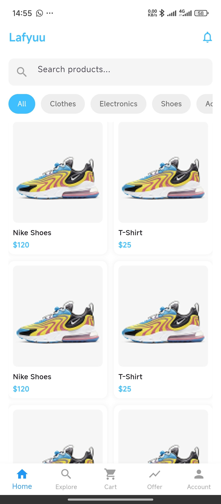

# Lafyuu Flutter App

A modern e-commerce mobile application built with Flutter.

## Screenshots

  
  
  
  
  

## ✨ Features

* User Authentication
* Product Listing
* Shopping Cart
* Clean UI Design
* Responsive Layout

## 🚀 Getting Started

### Prerequisites

* Flutter SDK installed
* Android Studio / VS Code
* Emulator or physical device

## 🛠 Built With

* Flutter
* Dart
* Material UI

## 👨‍💻 Author

Olurock
